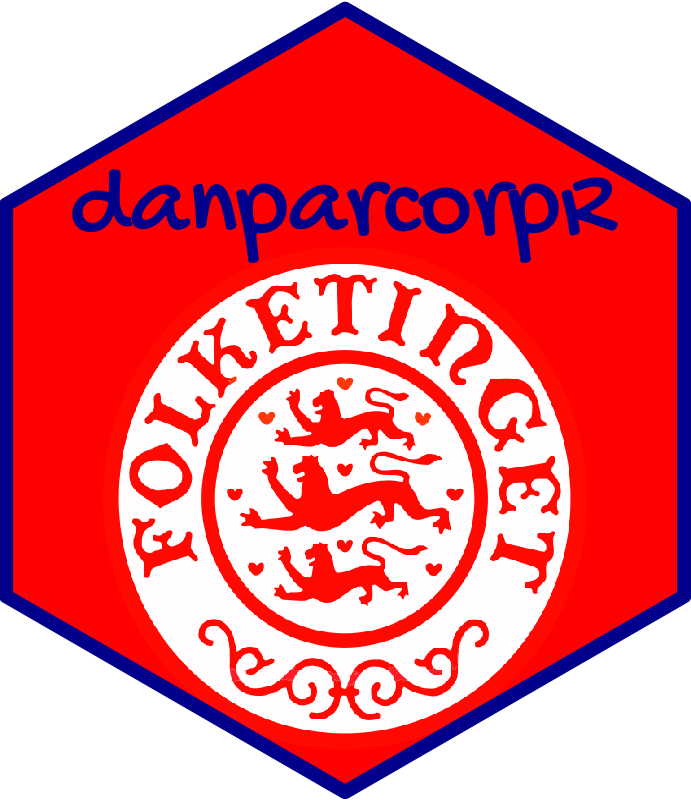
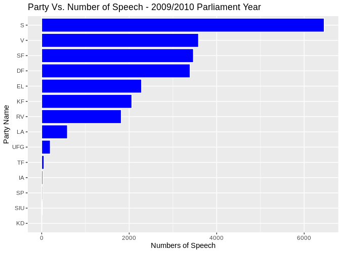
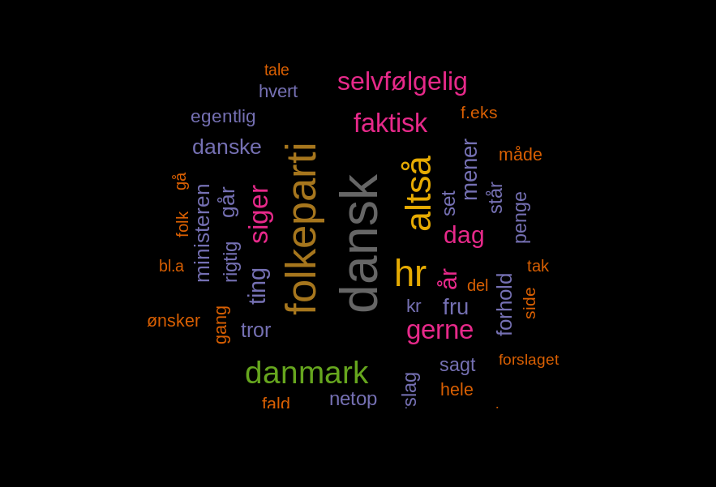

# danparcorpR <a href='https://peymankor.github.io/danparcorpR/'></a>

<!-- badges: start -->
[](https://www.tidyverse.org/lifecycle/#experimental)
[](https://opensource.org/licenses/MIT)
<!-- badges: end -->

The danparcorpR package, abbreviation for (The Danish Parliament Corpus in R) is package provides the *clean* and *tidy* data of Hansards (transcripts of parliamentary speeches) each year of Parliament (Folketinget) running from October to the following June. 

The whole package consisting of app. 41 million running words and 182.200 speeches. However, it must be mentioned that transcriptions are “corrected” by the Parliament transcription responsible so they are near to written language, e.g. they do not contain some typical speech features such as hesitations, self corrections and pauses, comprising filled pauses, and punctuation marks are added.


For each working year, (2009,2010,2011,2012,2013,2014,205,2016) the package provides *one* table containing the 9 columns:

Note: Each row is one *Speech* and columns provides the *feature* and specification of that row. The columns are:

* MeetingId     -       The ID of the parlimnat meeting

* Mødenummer    -       The number of the meeting

* Sagstype      -       The type of the speech

* Starttid      -       The start time of the speech (in y-m-d h-m-s format)    

* Sluttid       -       The end time of the speech (in y-m-d h-m-s format)

* Navn\*         -       The name of the speaker

* Parti\**         -       The party name of speaker

* Rolle         -       The role (position) of the speaker

* Tekst         -       The transcript of speech by the speaker


**Source:** [The Danish Parliament Corpus 2009 - 2017, v1](https://repository.clarin.dk/repository/xmlui/handle/20.500.12115/8)

**Important Note - 1**

In the Navn column you may see the empyt cell (""). These empty cells are mostly when the Rolle column is *formand* or *minister*, so the original data included the empty cell.

In the Parti column, the original data removed party section when the Rolle is *formand* or *minister* but in our case, we need the data for every cell. In this case, the "NA" was replaced.

So in summary, the empty cell ("") is when the orginal data had "" while "NA" was replaced by the package author in the case original data removed the parti name for speaker.

**Important Note - 2**

I wrote one full article about "Getting Started" with this package, with more details than below examples. The article is [here](https://peymankor.github.io/danparcorpR/articles/myvignette.html)

## Installation

Install the development version from [Github](https://github.com/Peymankor/danparcorpR):

``` r
# install.packages("remotes")
remotes::install_github("Peymankor/danparcorpR")
```

## Examples 

The distribution of number of speech for parties in the 2009 Parlimantary year.

``` r

# install the package from github
install.packages("remotes")
remotes::install_github("Peymankor/danparcorpR")
#

# load the library and tidyverse library
library(danparcorpR)
library(tidyverse)
#

# load the 2009 data
data(corp_2009)

# groub the speech by parti and then count
speech_by_party <- corpus_2009 %>% 
  group_by(Parti)  %>% 
  summarise(sum_speech = n()) %>% 
  drop_na() %>%           # remove the part "NA" (which are whether formand or minister)
  filter(Parti != "")
  
  ggplot(speech_by_party, aes(reorder(Parti, sum_speech), sum_speech)) +
  geom_bar(stat="identity", color="white", fill="blue") +
  xlab("Party Name") +
  ylab("Numbers of Speech") +
  ggtitle("Party Vs. Number of Speech - 2009/2010 Parlimant Year") +
  coord_flip()  
```




## Examples 

The hourly demand and generation (supply) of electricty in the US:

``` r
# load the packages
library(danparcorpR)
library(wordcloud)
library(tidytext)
#

# load the danish stop words
stop_word_danish <- read_delim("https://gist.githubusercontent.com/berteltorp/0cf8a0c7afea7f25ed754f24cfc2467b/raw/305d8e3930cc419e909d49d4b489c9773f75b2d6/stopord.txt"
           , delim = " ", col_names = "word")

# form the danish stop word as data frame
stop_word_danish_format <- tibble(stop_word_danish, lexicon="SMART")

# Select the DF party 
corpus_2010_DF <- corpus_2010 %>% filter(Parti == "DF")
corpus_2010_DF_tidy <- corpus_2010_DF %>% as_tibble() %>%
  unnest_tokens(word, Tekst)

par(bg="black")
corpus_2010_DF_tidy %>%
  anti_join(stop_word_danish_format) %>%
  count(word) %>%
  with(wordcloud(word, n, scale = c(4,0.5) ,
                 max.words = 50, random.order=FALSE, rot.per=0.35,
                 colors=brewer.pal(8, "Dark2")))

```


